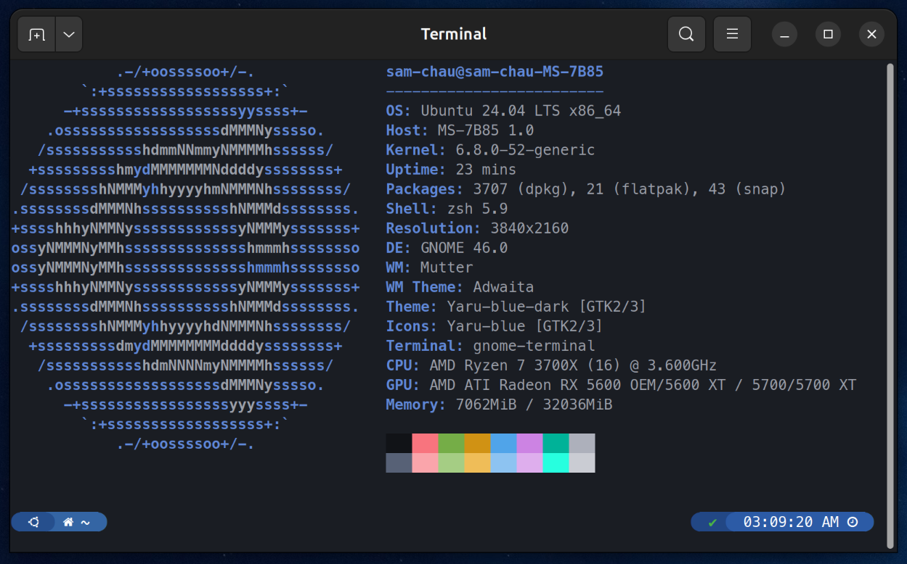

## Terminal Setup

Simple Zsh configuration with Powerlevel10k + custom Gogh AstroDark theme.

## Aliases

- `ll`: List files (long format with hidden)
- `c`: Clear terminal
- `..`: Go up one directory
- `myip`: Show local IP
- `screenoff`: Lock screen
- `o`: Open current directory in file manager
